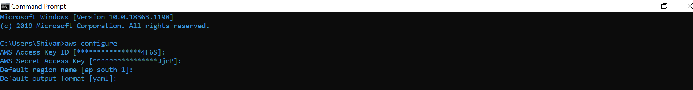

<p align="center"><a href="https://www.codechefvit.com" target="_blank"></a>
</p>

# Going serverless with Node.js

> <Subtitle>
> Building a Books CRUD appliction with AWS Lambda and DynamoDB as database.

---
[](https://documenter.getpostman.com/view/10014129/TVYM3vDP) 

## Downloading serverless CLI
```
Using npm (preferred)
$ npm install -g serverless 
```
## Downloading AWS CLI
```
Follow this link:

https://docs.aws.amazon.com/cli/latest/userguide/install-cliv2.html
```

## Configuring AWS
  

### Creating our serverless project using template
```
$ sls create --name YOUR_PROJECT_NAME --template-url https://github.com/codingly-io/sls-base
$ cd YOUR_PROJECT_NAME
$ npm install
```
## Deploying your project
```
To deploy the whole application:
sls deploy -v --stage dev/prod/test

To deploy one function :
sls deploy -f yourFunction -v

```


## Contributors
- <a href="https://github.com/N0v0cain3">Shivam Mehta </a>

## License
[](http://badges.mit-license.org)

<p align="center">
	With :heart: by <a href="https://www.codechefvit.com" target="_blank">CodeChef-VIT</a>
</p>
